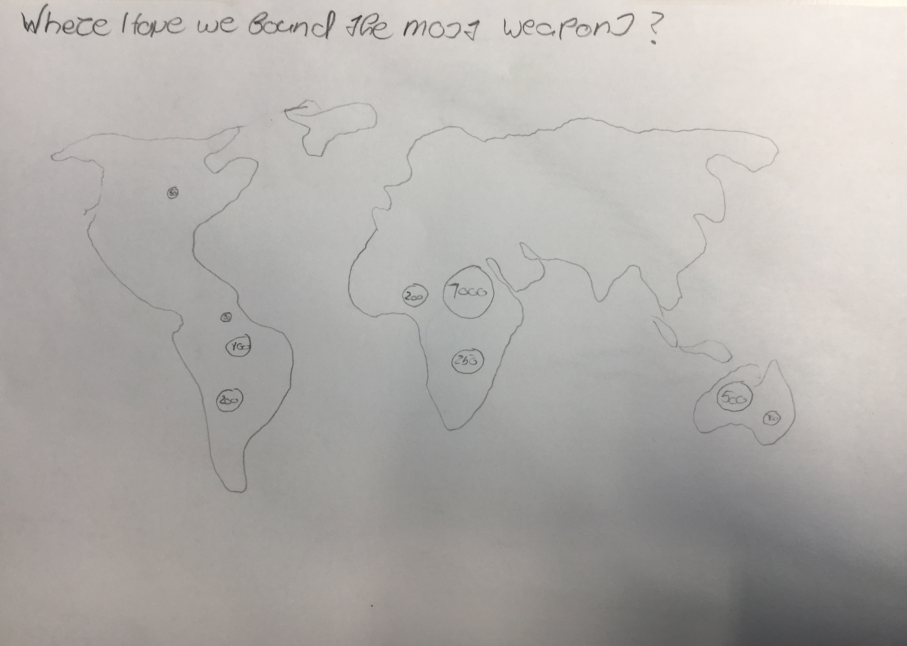
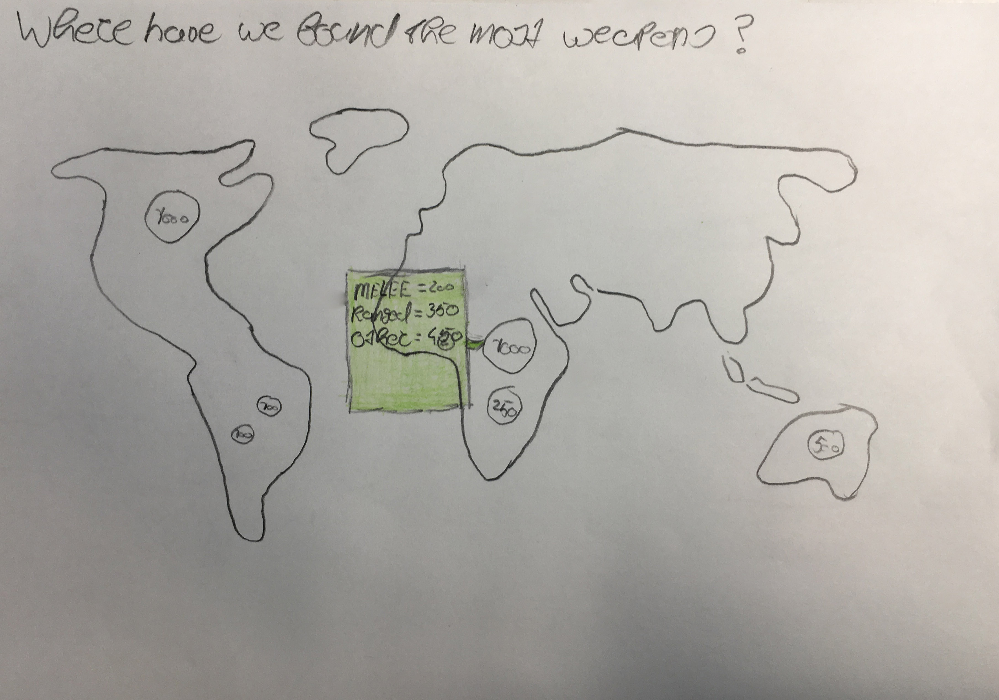
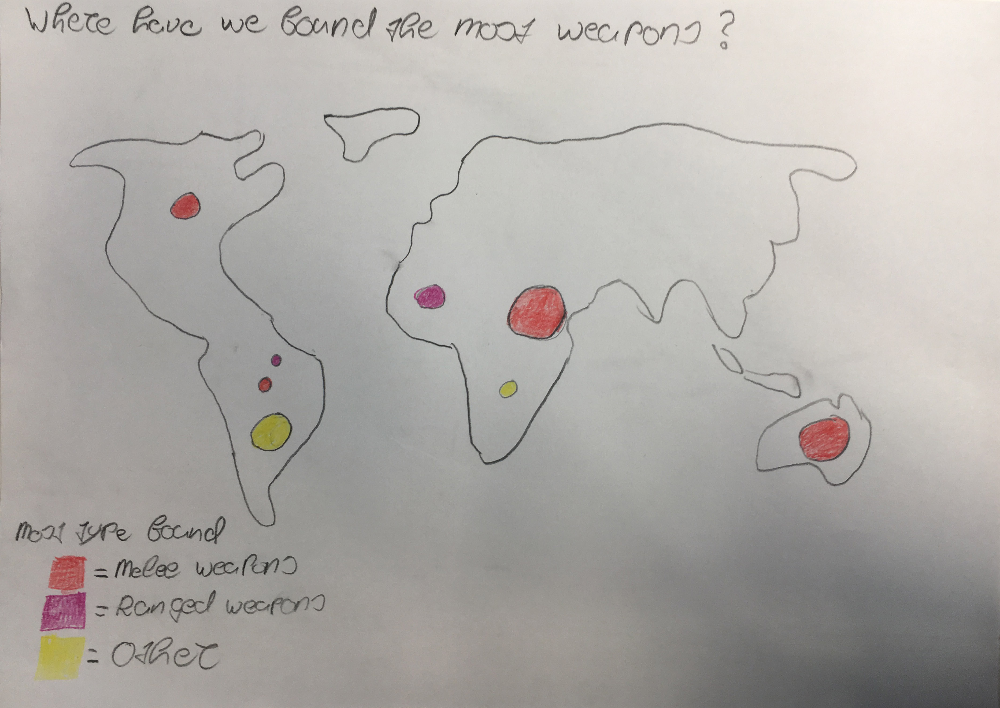

# Functional-programming 
Repository for the functional programming course

## Table of contents
* [Concept](#concept)

## Concept
The concept of this appliction revolves around the weapons collection of the NMVW. I want to show where the most weapons have been found based on the geonames that are pared with the objects, and show wich type of weapon where most found in a specific area. I got my inspiration for this concept from [Trulia](https://www.trulia.com/research/where-are-house-hunters-searching/), here they show where people are searching for a new home.

The circle that is displayed on the map where weapons have been found will grow depending on how many weapons have been found in that erea.

### Early concept sketches

### Benodigde data
* Objects of the weapon category
* Geonames pared with those objects
* Type of weapon